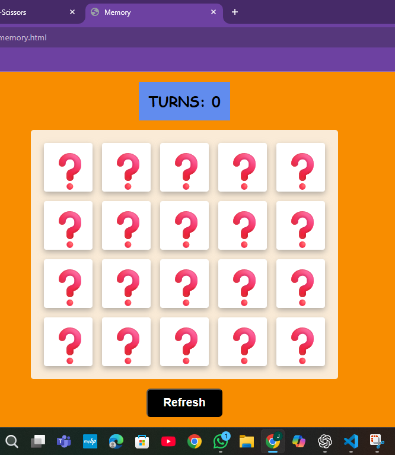
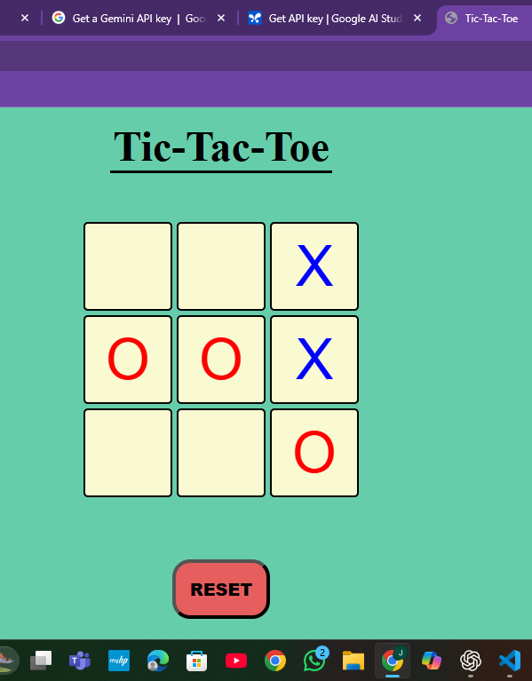
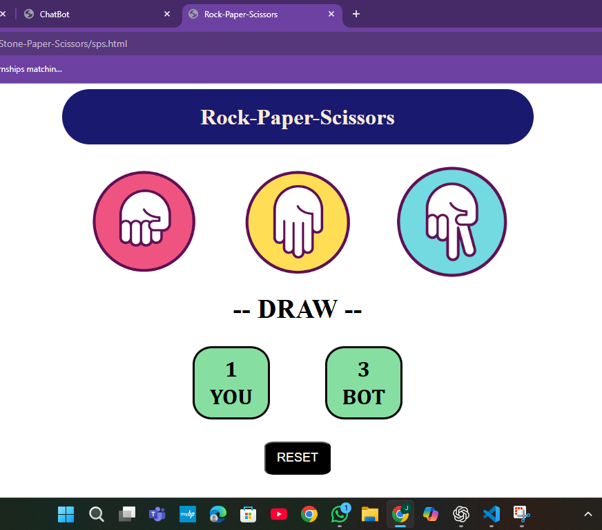

I love making Games with HTML, CSS, Js... I will share here all future JS projects
- keep learning, keep growing 

## How to Run:
- go to Gamehub.html file
- open with live server

# Preview
- 1st image: Memory game
- 2nd image: tic-tac-toe
- 3rd image: stone paper scissors

